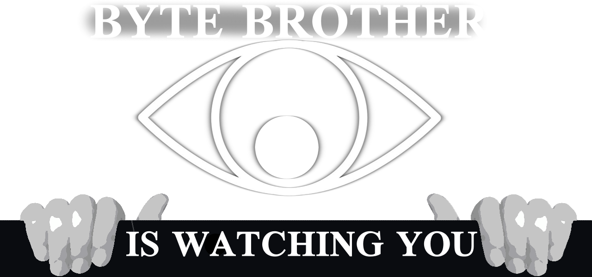
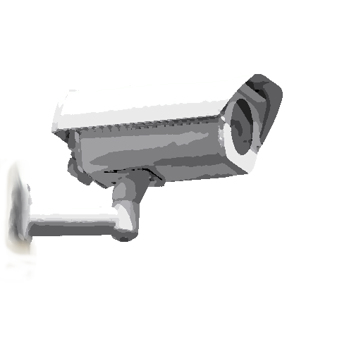

- [x] Track which applications are being used and for how long and how often.

- [x] Logs every connection made in the open network. (http, microsoft connections, etc.)

- [x] Global keylogger

- [x] Clipboard: Save clipboard content, text and images

- [ ] Screen Activity: Record screenshots periodically to visualize what's happening on the screen.

- [ ] Website Visits: Monitor web browsing activity, including URLs visited and time spent on each site.

- [ ] Hardware Usage: Monitor hardware usage such as CPU, memory, and disk usage to understand system performance and resource utilization.

- [ ] User Interaction: Record mouse movements and clicks to understand how users are interacting with the system.

- [ ] System Settings Changes: Monitor changes to system settings, preferences, and configurations.

- [ ] System Events: Monitor system events such as logins, logouts, shutdowns, and application launches.

- [ ] Software Installations/Uninstallations: Record when new software is installed or existing software is removed from the system.

- [x] Klinoff implementation

